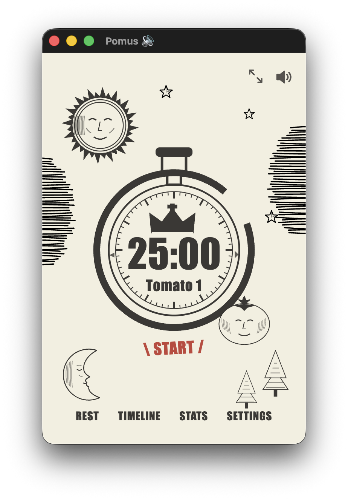
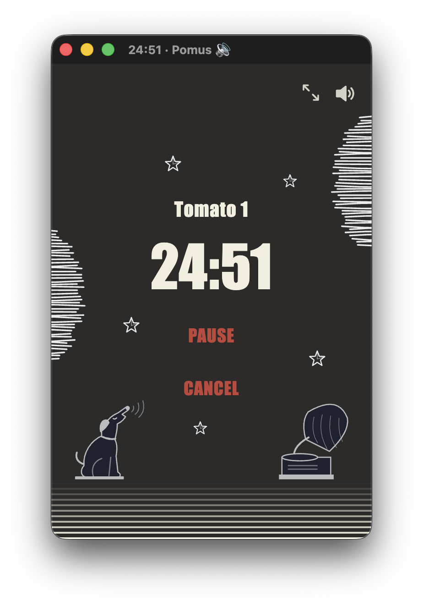

# Pomus

A Pomodoro timer for the Linux and macOS desktop, in a vintage engraving style. Plain HTML/CSS/JS — no build step — in a small Electron window.

  
  

## Features
- 25 min focus, 5 min break, 15 min long break every 4 tomatoes (all configurable)
- Optional auto-start breaks (off by default), pause/resume/cancel
- Tick-tock and end-of-cycle alarm, with a mute toggle
- Timeline and stats (last 7 days)
- Tiny mini mode for the timer
- Always-on-top window
- Timer survives closing and reopening the window
- Data stays local (`localStorage`)

## Requirements
- Node.js and npm (Electron is installed on first run)

## Run
    ./install.sh      # adds "Pomus" to the applications menu
    ./pomus.sh        # or launch directly

On macOS:

    ./install-mac.sh  # builds ~/Applications/Pomus.app and pins it to the Dock
                      # re-run it after pulling changes

History from the old Chrome app version is imported on first launch.

To test quickly: Settings → Focus = 0.1 (6 seconds).

## Files
- `index.html`, `style.css`, `app.js` — the app
- `main.js`, `preload.js` — Electron window (size, always on top, mini mode resize)
- `art/` — original SVG illustrations
- `screenshots/` — images used in this README
- `pomus.sh` — launcher
- `install-mac.sh` — builds `Pomus.app` for the macOS Dock
- `install.sh` — creates the `.desktop` entry

## License
MIT
